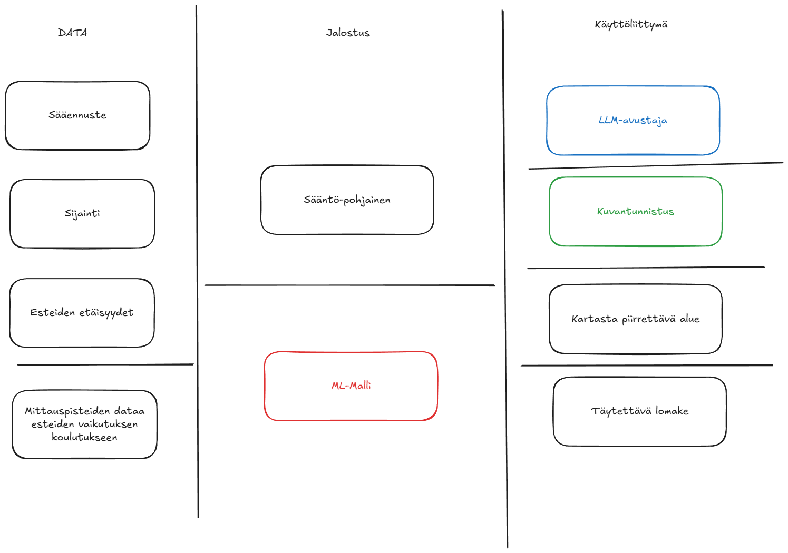

# Voisko tän tehdä AI:lla?

AI projektit herättää kovasti kiinnostusta ja hyviä ideoita putkahtelee esiin. 80% ideoista on kuitenkin syvemmän tarkastelun jälkeen osoittautuu data projekteiksi.

Kaveri kuvaili juhannuksena vähä korkealentoista ideaa: Voisko AI:lla tehdä palvelun josta näkis tuulen nopeudet hyvin tarkalla sijainnilla. Puhui rakennusten etäisyyksistä ym, vaikutelman jäi että siinä päätettiin pallogrillin istutuspaikkaa eikä tuulivoimapuiston perustuksia. Kehuin ideaa hyväksi ja toivotin hauskat juhannukset. Olin juuri lähdössä lenkille ja tästä saikin sopivaa haastetta mielelle. 

## Projektin toteutus 

### Tarve: 

Vastaa käyttäjän kysymykseen
*Minne sijoitan pallogrillin ja picnic pöydän mökillä juhannukseksi?* 

### Datat: 

Helposti hankittavat:
- Tarkka sijainti
- Sääennuste dataa.  
- Maan muodot -> hylätty, tämän vaikutuksen odotetaan esiintyvän sääennuste datassa

Mutta mites hoidetaan tuo mökin kulmien erottaminen? 

**A: Kartutetaan esimerkki dataa**

- Mittaripisteitä, mitä enemmän sen parempi
  - Tarkka sijainti
  - Tieto esteiden etäisyydestä(8 ilmansuuntaa, etäisyys metreinä. Rakennukset, metsät tms)
  - Tuulitiedot, esim: nopeus ja suunta tunneittain 
  - Kerätään tästä kohdasta myös käytettävän sääpalvelun sääennuste-data. 

**B: Toteutetaan laskenta**

Kovalla mutuilulla esteiden etäisyys voisi vaikuttaa:
- Jos este on suunnassa josta tuuli tulee, tuulee vähemmän kuin ennuste, mitä lähempänä sen isompi vaikutus
- Jos esteet muodostavat tuulen suuntaisen tunnelin, tuulee enemmän kuin ennuste.

### Laskenta: 

Tässä vaiheessa meillä on tarvittavat datat työstää alustaa eteenpäin. 
Jos ollaan valittu edellisessä kohdassa A, niin nyt voidaan tähän projektiin implementoida AI:ta. Ei kuitenkaan sitä LLM vaan ML, eli koneoppimista. 
ML boomi tuli markkinoille vähä aiemmin kuin LLM tekoälytyökalut tulivat koko kansan käyttöön. 
Se ei ollut niin vahvaa kuin huomio mitä suuret kielimallit saa, mutta on oikea työkalu useisiin kohtiin jossa nyt pohditaan voiko ai hoitaa. 

Halutaan siis laskea esteiden vaikutuksia tuuleen. 

Mallille syötettävä koulutuksen data: 
- Pvm ja kellonaika
- Sääpalvelun sääennusteEnnustettu tuulennopeus ja suunta 
- Mittaripisteelle ilmoitetut esteiden etäisyydet 
- Toteutunut tuulennopeus ja suunta 

ja ennustettavat arvot olisi toteutunut tuulennopeus ja suunta. 

Jos aiemmassa kohdassa päädyttiin toteuttamaan laskenta, niin toteutetaan sellainen nyt. 

Lopputulemana meillä on molemmissa tapauksissa rajapinta, mikä antaa esteet huomioon ottaen tuuliennusteen näillä tiedoilla: 
- Pvm ja kellonaika
- Sijainti 
- Esteiden etäisyydet 

### Käyttöliittymä:

Palaan mielessäni taas tähän keskusteluun kaverin kanssa pohtiessani miten käyttäjä tätä dataa hyödyntäisi helpoiten. 
Mökille on saavuttu ja ensimmäinen satsi käristeitä pitäisi jo saada tulille, mutta mihin? 

- Vertailu
  - Helppo 2 eri sijainnin (Joita erottaa esteiden etäisyys-tiedot)
- Aikajakso
  - Määritellään mahdollisesti alkua ja loppupäivät
- MobileFirst 
- Tehokas tietojen syöttö. 
  - 8 eri metri-arvon mittaus ja syöttäminen per paikka voi tuntua kankealta

**Voisko tän tehdä AI:lla?**

Kyllä, näkisin että tän vois tehdä ai:lla, ja *esimerkiksi* sillä LLM:llä.

AI esittäytyy käyttäjälle: 

*Heippa olen avustajasi tuulen ennustamisessa, kuvaile minulle paikkasi, tai paikkojesi esteiden etäisyydet käyttäen ilmansuuntia ja metrejä. Kerro myös miltä jaksolta haluat ennusteet. Toteutan sinulle haun palvelusta kun vaadittavat tiedot on saatu*

Käyttäjä kuvailee joko kirjoittaen tai sanelulla:

*Saavuttu tähän mökille ja sunnuntaina pois, tai no lauantaina illalla jo lopetellaan grillaus. Paikka 1: Mökin länsipuolella 4 metrin päässä, sillä puolella on meri joten ei muita esteitä. Paikka 2: Mökin eteläreunalla, 4 metrin päässä, vierasmökki on 10 metrin päässä etelässä vähän pienempi rakennus. Tontin länsireunalla 25metrin päässä tästä on aika tiheä metsä joka pitää hyvin tuulta*

AI tekee tästä päätelmät 
- Aikajakso: nyt - lauantai puoleenyöhön.
- Sijainti: Palvelu tarkastaa laitteen gps:n avulla
- Rakennusten etäisyydet:
  - 1: itä 4m 
  - 2: pohjoinen 4m, etelä 10m, länsi 25m 
  
AI saa näillä tiedoilla haettua tunnittaiset mittaukset molemmille pisteille rajapinnasta. Voidaan palauttaa listaus käyttäjän tarkasteltavaksi.

Käyttöliittymä vois vaihtoehtoisesti olla aikajakson valinta + taas yhtä erilaista ai-tekniikkaa: kuvantunnistusta. 
Tai mahdollisesti olisko paras jos aikajakson lisäksi aukeais sateliitti kuva missä olis nämä 8 suuntaa jo valmiina ja jokaisen viivan pituus määriteltäisiin erikseen.

## Lopetus

Projektille on hyvä pohtia ylittääkö odotettu arvo arvioidut kustannukset. Tämä raja on madaltunut paljon AI-työkalujen tehostaessa kehitystä. Kuitenkaan kaikki pitkälle jalostetutkaan ideat eivät ole edelleenkään toteutuksen arvoisia. 

Tämä jää omalta osalta lyhyeksi aivojumpaksi. Mielenkiintoista olisi kuitenkin tietää miten tämä vertautuisi chatgpt:lle esitettävää kuva + kysymys "*Kummassa tuulee enemmän*" viestiin. Tuntuu kuitenkin että keskiverto suomalainen luottaa enemmän suuriin kielimalleihin kuin sääennusteisiin. 

Mutta saisiko tämän projektin pivotoitua hyttysten välttelemiseen, siinä voisin nähdä todellista arvoa.
