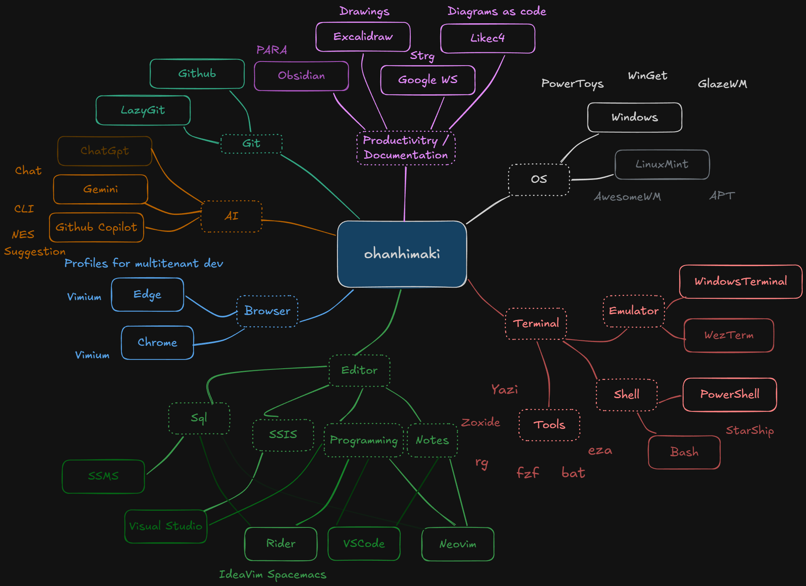

# Playbook

Tänne kirjoittelen työkaluista mitä itsellä on käytössä, sisältö on pieniä esittelyjä, konfigurointi-ohjeita ja hyödyllisiä toistettavia työvaiheita esim. kyselyiä kannan esiintymien hakemiseen näkymistä ja proseduureista, tai neovim substitute vinkkejä tehokkaaseen sql työskentelyyn. 

 

Rakennetta: 

# Käyttöjärjestelmä 

## Windows 

### Työkaluja 

Glazewm, powertoys , winget

## Linux 

Awesomewm, omina kokemuksia kotikäytössä yms? 

# Terminaali 

Terminaalin kautta monet jutut onnistuu oman kokemuksen mukaan paljon
tehokkaammin kuin erilaisilla gui sovelluksilla. 

## Emulaattori

### Windows terminal

### Wezterm 

### Kitty 

## Shelli 

### Powershell

### Bash

## Muita terminaalityökaluja 

Yazi, zoxide, rg, fzf, bat , eza

# Editorit

## Neovim 

## VSCode

## Rider

## Visual Studio

## SSMS

# Browser

Chrome, Edge, eri use caset

# AI 

## Gemini

## Github copilot 

# Git 

Githubissa omat repot.

Azuredevops töiden kautta tuttu.

Lazygittiä omissa ympäristöissä, visualstudion git työkalua tai komentoriviä
mahdollisuuksien mukaan asiakasympäristöissä.

# BI-kehitys

## SSIS -maailma

## Microsoft fabric

